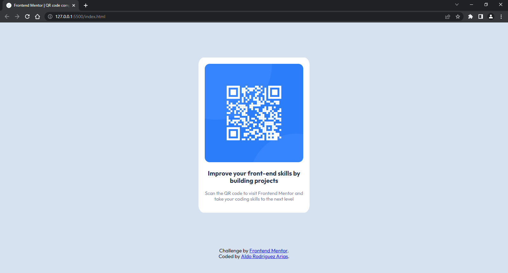

# Frontend Mentor - QR code component solution

This is a solution to the [QR code component challenge on Frontend Mentor](https://www.frontendmentor.io/challenges/qr-code-component-iux_sIO_H). Frontend Mentor challenges help you improve your coding skills by building realistic projects.

## Table of contents

- [Overview](#overview)
  - [Screenshot](#screenshot)
  - [Links](#links)
- [My process](#my-process)
  - [Built with](#built-with)
  - [What I learned](#what-i-learned)
  - [Continued development](#continued-development)
  - [Useful resources](#useful-resources)
- [Author](#author)

**Note: Delete this note and update the table of contents based on what sections you keep.**

## Overview

### Screenshot



### Links

- Solution URL: [Github](https://github.com/AldoRdz2001/QR_Challenge.git)
- Live Site URL: [Netfly](https://your-live-site-url.com)

## My process

### Built with

- Add Normalize.css.
- Make the structure of html.
- Import the css files.
- Import the font.
- Create global variables in style.css
- Create the container.
- Add the image and syle of the paragraph.

### What I learned

I'm proun of center a div, cause was dificult for me.

To see how you can add code snippets, see below:

```css
.contenedor {
    width: min(90%, 35rem);
    margin: 11rem auto;
    background-color: var(--white);
    padding: 2rem;
    border-radius: 5%;
}
```

### Continued development

I wanna use more JS for more animations and things, or get better understanding of CSS and tricks.

### Useful resources

- [Desarrollo Web Completo con HTML5, CSS3, JS AJAX PHP y MySQL](https://www.udemy.com/share/1013ea/) - This helped me for all my project.

## Author

- Website - [Add your name here](https://www.your-site.com)
- Frontend Mentor - [@AldoRdz2001](https://www.frontendmentor.io/profile/AldoRdz2001)
